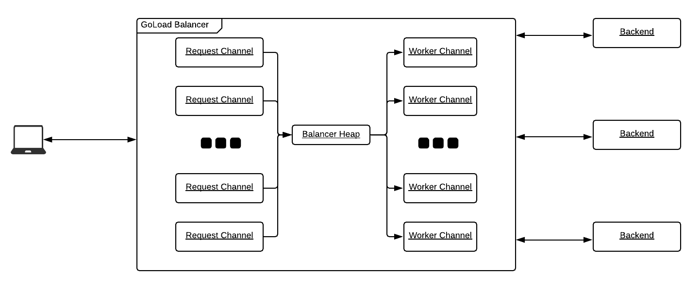

# GoLoad Balancer

> A quick-and-dirty load balancer written with Go.

## Table of Contents

- [GoLoad Balancer](#goload-balancer)
  - [Table of Contents](#table-of-contents)
  - [Description](#description)
    - [Architecture](#architecture)
    - [Goroutines](#goroutines)
    - [Channels](#channels)
  - [Running the Server](#running-the-server)
    - [Prerequisites](#prerequisites)
    - [Makefile](#makefile)
  - [Future Work](#future-work)
  - [License](#license)
  - [Resources](#resources)

## Description

GoLoad balancer is a personal attempt to prove to myself the usefulness of the concurrency primitives provided by Go, namely the ability to share memory and run concurrent workloads using only goroutines and channels, as described in [Tony Hoare's paper](https://www.cs.cmu.edu/~crary/819-f09/Hoare78.pdf).

The load balancer takes HTTP requests and forwards them to a pre-configured set of backend web services.

### Architecture

### Goroutines

The balancer, workers and incoming requests all run on their own goroutines.  Further, every single request that is forwarded to a backend is also processed by the worker on a separate goroutine.  This prevents any single part of execution from blocking further incoming requests.

### Channels

Each incoming request is given its own output channel that is used to read and return the response from the backend, when it becomes available.

The balancer itself uses a "work" channel from which to consume and dispatch incoming requests to the least busy worker.  The balancer itself uses a heap to sort all workers based on the number of work requests that each is handling at a given moment; workers with a smaller number of pending jobs will bubble up to the top of the heap.

The workers are given two channels, the output channel (mentioned previously) used to communicate the response from the backend to the incoming request, as well as a channel used to communicate to the balancer that it has finished processing a job.

## Running the Server

### Prerequisites

You'll need Docker, Docker Compose and Go 1.13+ to run the GoLoad Balancer.  To run the benchmarking tests, you'll need `ab` installed on your machine.

### Makefile

All tasks for running the server are maintained in the Makefile.  To run the balancer, you'll first need to startup the backend services with `make start_backend`.  Once these are running, you can run `make run` to build and start the load balancer.  At this point, running `curl localhost:8080` should return "Hello from #", where # is the id of the backend chosen to process the request.

To test the balancer against arbitrary web traffic, run `make load_test` once the server is up.

## Future Work

Low-hanging fruit I'd like to add in the future would begin with:

- Request header and body parsing 
- Configuration of arbitrary frontends and backends using toml or yaml
- Hostname, path and port matching
- Rate limiting
- Logging

## License

- **[MIT license](http://opensource.org/licenses/mit-license.php)**

## Resources

This hackathon project was largely inspired by a great talk by Rob Pike called [Concurrency is not parallelism](https://www.youtube.com/watch?v=cN_DpYBzKso).
